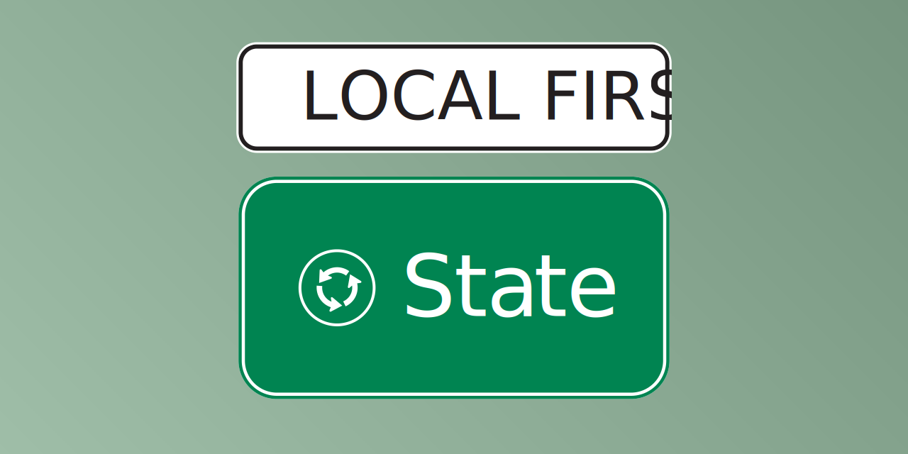
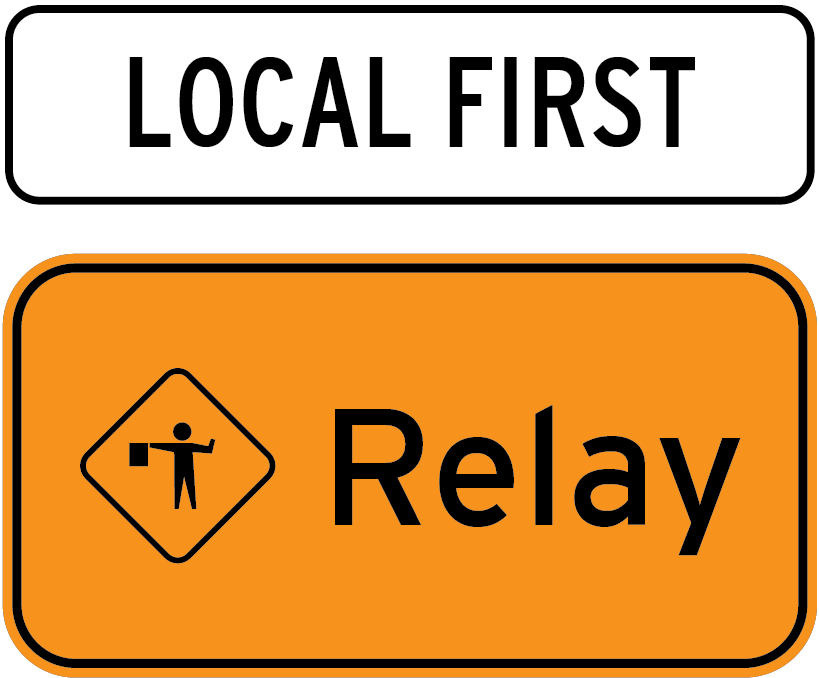

## Colors

| Color  | Hex                                                                         | repo  |
| ------ | --------------------------------------------------------------------------- | ----- |
| Green  |  #008451 | state |
| Blue   |  #243E87 | auth  |
| Orange |  #F7921E | relay |

## Logos

### SVG

</img>

</img>

<table>
<tr>
<td>logo</td>
<td></td>
<td></td>
<td></td>
</tr>
<tr>
<td>horiz</td>
<td></td>
<td></td>
<td></td>
</tr>
<tr>
<td>horiz</td>
<td></td>
<td></td>
<td></td>
</tr>
<tr>
<td>vert</td>
<td></td>
<td></td>
<td></td>
</tr>
<tr>
<td>social</td>
<td></td>
<td></td>
<td></td>
</tr>
</table>

### PNG

</img>

</img>

<table>
<tr>
<td>logo</td>
<td></td>
<td></td>
<td></td>
</tr>
<tr>
<td>horiz</td>
<td></td>
<td></td>
<td></td>
</tr>
<tr>
<td>horiz</td>
<td></td>
<td></td>
<td></td>
</tr>
<tr>
<td>vert</td>
<td></td>
<td></td>
<td></td>
</tr>
<tr>
<td>social</td>
<td></td>
<td></td>
<td></td>
</tr>
</table>
